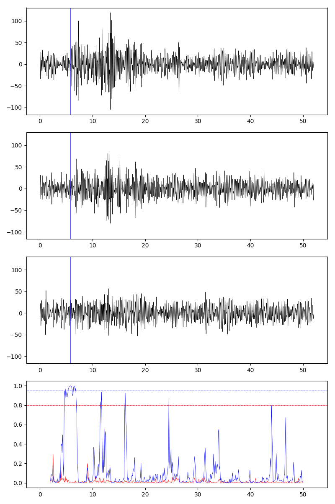

# cnn

Before using this script, you maight need to configure a redis server first,then put the server ip and accounts in redis2app.py,and also change the ip in gpd_predict_liss_from_fujian_single_station.py.

Run this under keras2.2.2 and tesorflow1.10:

./gpd_predict_liss_from_fujian_single_station.py --V true --para_path scedc_model --plot true --receive_interval 30  --output_path gpd_model_predicts --save_mseed true

One sample:

